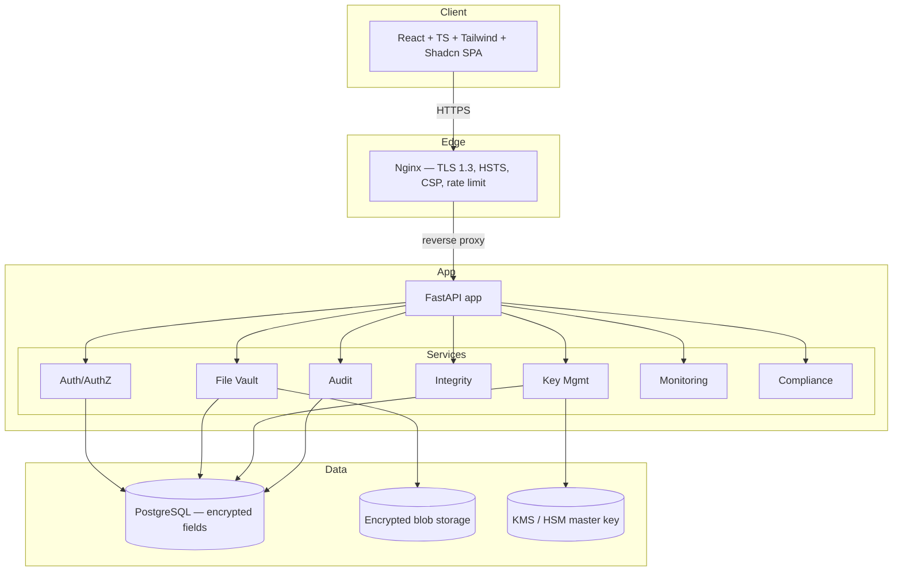
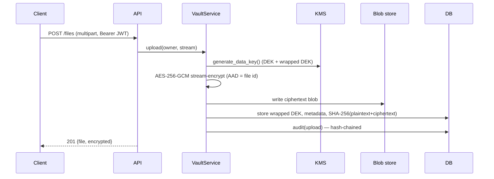
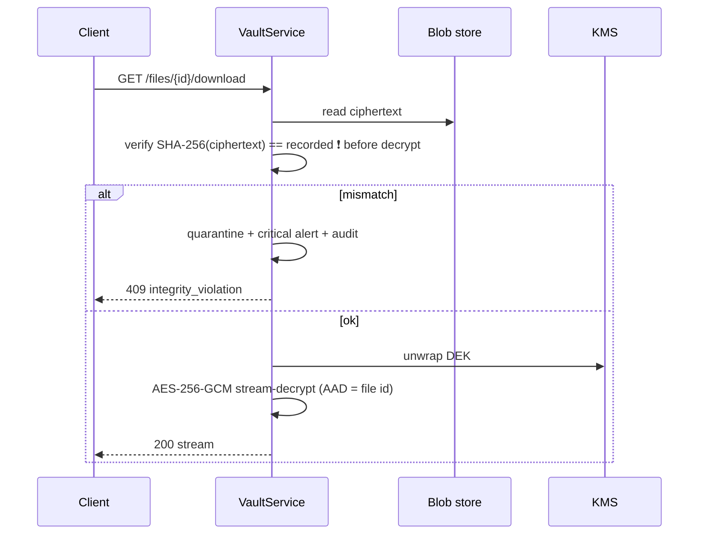
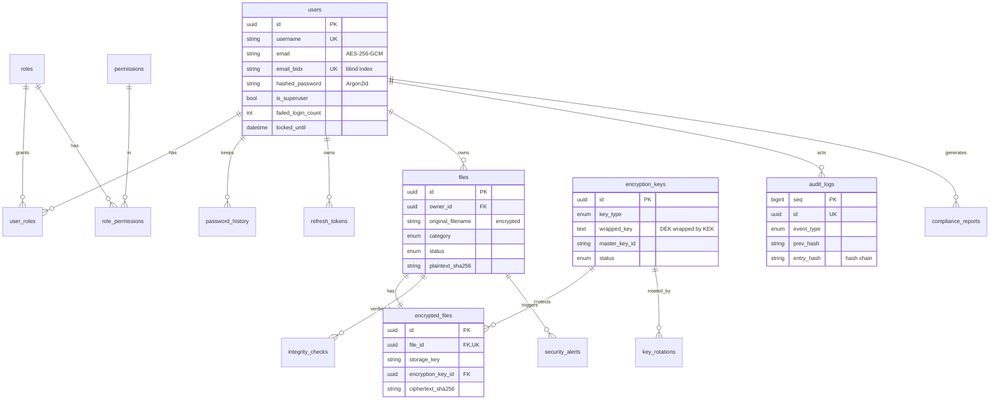

# SDPP Architecture

## 1. System context



## 2. Layered design (clean architecture)

```
core/        pure primitives & policy — NO db/web imports
  ├─ security/   crypto, hashing, passwords, tokens, envelope, field_encryption, audit_chain
  ├─ kms/        master-key provider abstraction (local / aws / azure / vault)
  ├─ authz/      permission catalog + access checks
  ├─ compliance/ control catalog + evaluator
  ├─ config.py   validated settings (fail-fast)
  └─ bootstrap.py startup seeding

db/          declarative base, adaptive types, async session
models/      ORM (depends on core, db)
schemas/     Pydantic API contract
services/    business logic (depends on models, core)  ← transactions, audit
api/         HTTP layer: deps, middleware, errors, routers  ← maps to/from services
main.py      app factory + lifespan
```

**Dependency rule:** `api → services → models → db/core`. Core never imports
upward. This is what let the crypto core be tested in total isolation (100 tests
with zero database).

## 3. Encryption data flow (upload)



## 4. Decryption data flow (download)



## 5. Entity-Relationship Diagram



## 6. Request lifecycle

1. **Nginx** terminates TLS 1.3, applies HSTS/CSP/security headers + rate limits.
2. **CORS + SecurityHeaders middleware** in FastAPI (defense in depth).
3. **Dependency injection**: `get_db` → request-scoped async session; bearer →
   `Principal` (decoded JWT with embedded permissions); `require_permission`.
4. **Router** validates the Pydantic request, calls a **service**.
5. **Service** performs crypto/KMS/db work and writes a **hash-chained audit** entry.
6. `get_db` commits on success / rolls back on error (security-state failure paths
   commit explicitly so lockout counters + failed-login audits persist).
7. **Exception handlers** map errors to safe responses (no leakage, no oracles).

## 7. Technology choices

| Layer | Choice | Why |
|-------|--------|-----|
| API | FastAPI + Pydantic v2 | async, typed, OpenAPI, boundary validation |
| ORM | SQLAlchemy 2.0 async | typed models, dialect-adaptive types |
| DB | PostgreSQL | JSONB, native UUID, triggers (audit immutability) |
| Crypto | `cryptography` (AES-GCM), `argon2-cffi` | vetted, AES-NI, memory-hard |
| Tokens | PyJWT | standard JWT with strict claim validation |
| Edge | Nginx | TLS 1.3 termination, headers, rate limiting |
| Tests | pytest + hypothesis + Locust | unit/property/integration/security/load |
